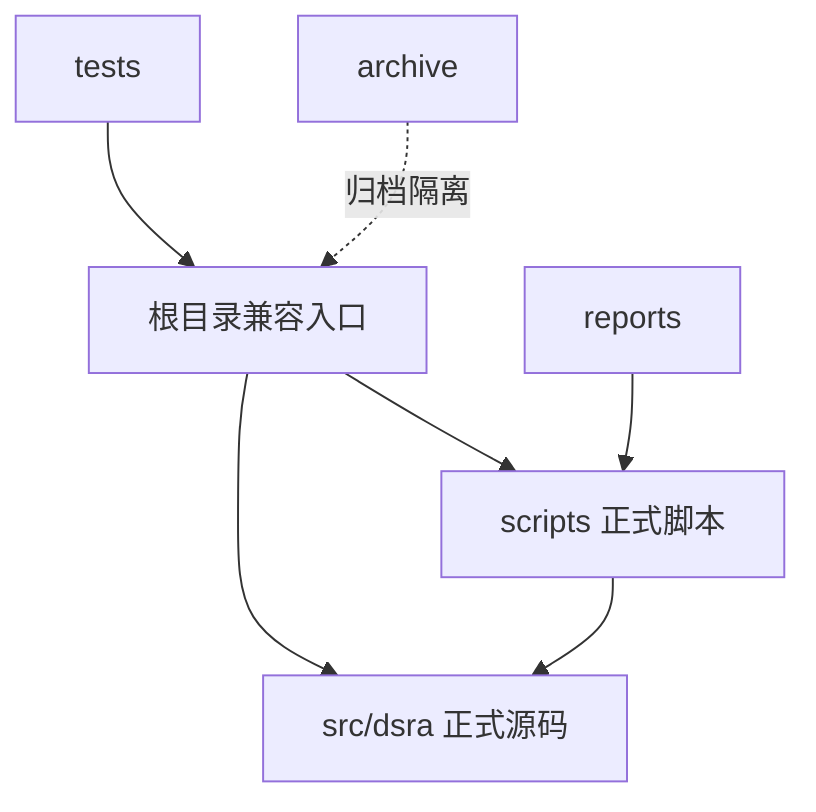

# 技术设计: 目录分层重构与兼容适配

## 技术方案
### 核心技术
- Python 3.10
- `setuptools` 平铺模块兼容配置
- 根目录兼容薄封装 + `src/` 正式实现结构

### 实现要点
- 新增 `src/dsra/` 作为正式源码包，承载核心层、模型、报告工具与实验逻辑。
- 新增 `scripts/` 放置统一测试入口与实验脚本的正式实现。
- 根目录保留历史文件名对应的兼容入口，内部仅转发到新位置，避免现有导入断裂。
- 调整 `pyproject.toml`，使测试与包发现可识别 `src/` 布局。
- 新增 `archive/` 归档历史 `copy` 文件、旧报告副本与静态测试数据副本。

## 架构设计

## 架构决策 ADR
### ADR-20260425-01: 使用兼容薄封装替代一次性导入改写
**上下文:** 现有测试和脚本均依赖根目录模块名，直接全量替换导入成本高且风险大。  
**决策:** 将正式实现迁入 `src/` 与 `scripts/`，根目录同名文件保留为稳定转发层。  
**理由:** 可以在最小破坏面下完成结构升级，同时逐步迁移未来导入。  
**替代方案:** 直接批量改写所有导入到 `src` 包路径 → 拒绝原因: 风险高、影响面大、回归验证成本高。  
**影响:** 仓库会短期保留少量兼容文件，但可换来稳定调用与渐进式迁移能力。

## 安全与性能
- **安全:** 不引入动态路径执行，不通过修改 `sys.path` 注入不受控目录；兼容层仅做显式模块转发。
- **性能:** 导入层增加一次轻量转发，运行期开销可忽略；目录清晰度提升后维护效率更高。

## 测试与部署
- **测试:** 运行 `pytest`，运行 `python main.py unit`，必要时验证单个实验入口导入。
- **部署:** 无部署变更；本次仅为仓库布局和本地执行方式重构。
