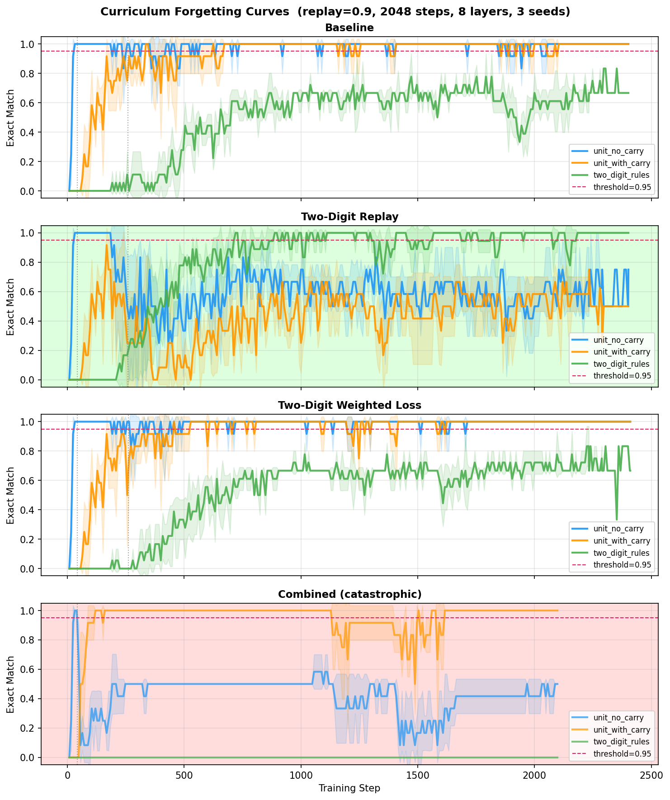
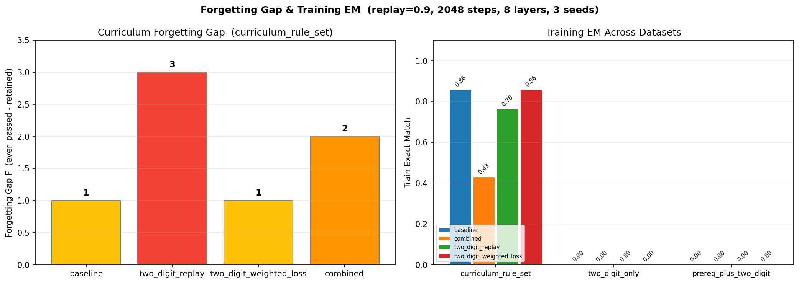
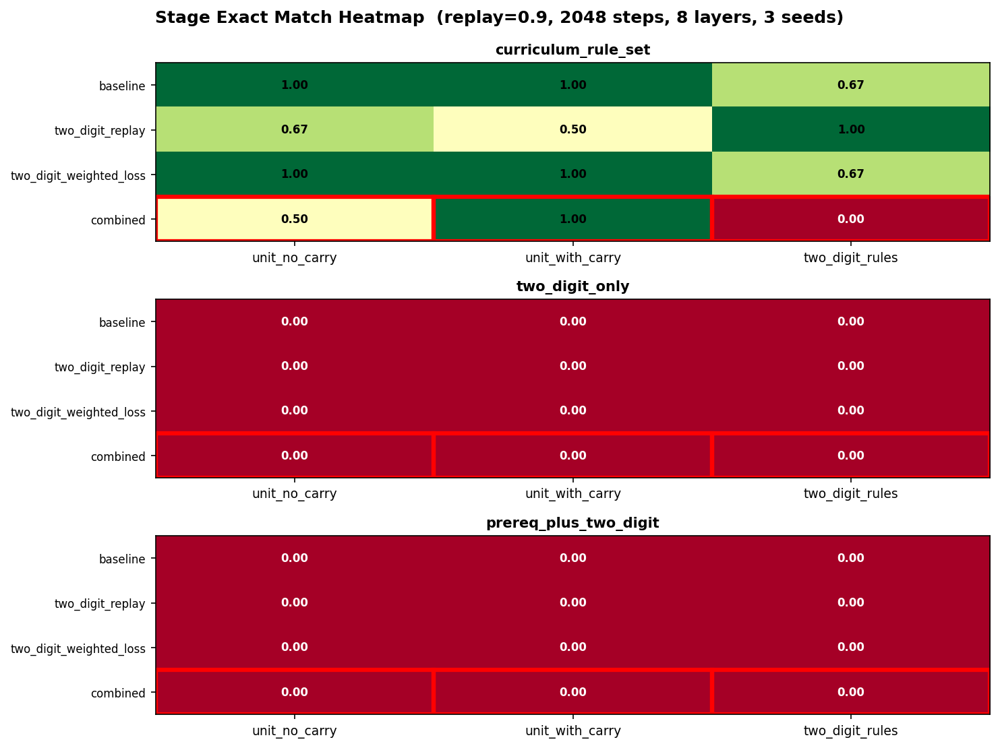
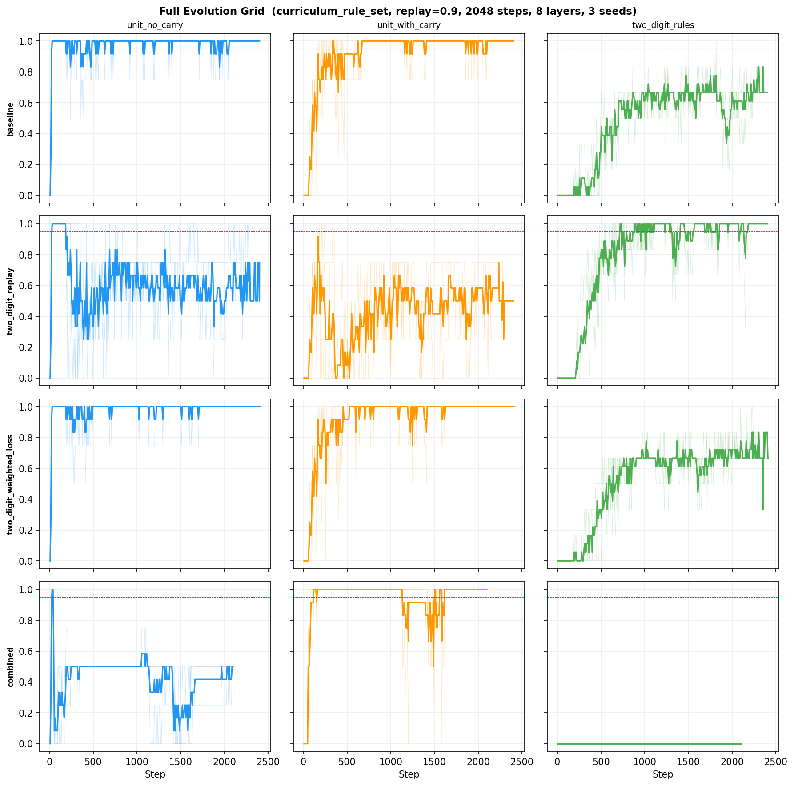

# MHDSRA2 Curriculum Forgetting Curve Report

## Configuration

- Datasets: curriculum_rule_set
- Training strategies: baseline, two_digit_replay, two_digit_weighted_loss, combined
- Seeds: 101, 202, 303
- Layers: 8
- Max steps per stage: 2048
- Curriculum eval interval: 8
- Stage threshold: 0.95
- Stage patience: 3
- Replay ratio: 0.75
- Two-digit replay ratio (carry): 0.9
- Learning rate: 0.01
- Device: auto

## Summary

| Dataset | Strategy | Runs | Retained Mean | Ever Passed Mean | Forgetting Gap | Catastrophic | Train EM Mean |
|:---|---:|---:|---:|---:|---:|:---:|---:|
| curriculum_rule_set | baseline | 3 | 2.00 | 2.67 | 1 | no | 0.8571 |
| curriculum_rule_set | two_digit_replay | 3 | 0.00 | 3.00 | 3 | yes | 0.7619 |
| curriculum_rule_set | two_digit_weighted_loss | 3 | 2.00 | 2.67 | 1 | no | 0.8571 |
| curriculum_rule_set | combined | 3 | 0.00 | 2.00 | 2 | yes | 0.4286 |

## Stage-Level Exact Match

| Dataset | Strategy | unit_no_carry | unit_with_carry | two_digit_rules |
|:---|---:|---:|---:|---:|
| curriculum_rule_set | baseline | 1.0000 | 1.0000 | 0.6667 |
| curriculum_rule_set | two_digit_replay | 0.6667 | 0.5000 | 1.0000 |
| curriculum_rule_set | two_digit_weighted_loss | 1.0000 | 1.0000 | 0.6667 |
| curriculum_rule_set | combined | 0.5000 | 1.0000 | 0.0000 |

## Figures

### Figure 1: Curriculum Forgetting Curves

Per-strategy EM-vs-step traces for `curriculum_rule_set`. Combined row is highlighted in red (catastrophic forgetting).

### Figure 2: Forgetting Gap & Training EM

Left: forgetting gap F = ever_passed - retained for `curriculum_rule_set`. Right: train EM across all datasets.

### Figure 3: Stage EM Heatmap

Per-stage final EM across all datasets and strategies. Red border marks combined (catastrophic) row.

### Figure 4: Full Evolution Grid

Every strategy × stage EM-vs-step trace for `curriculum_rule_set`. Thick line = mean, thin lines = individual seeds.

